**English** | [简体中文](README.zh_CN.md)

# FOrcaSlicer — Flexible OrcaSlicer

A fork of [Snapmaker OrcaSlicer](https://github.com/Snapmaker/OrcaSlicer) for the Snapmaker U1, built on one idea: the U1 has four independent heads, so stop making them all do the same job. Give each head its own nozzle size, line width, and speed — a fine nozzle on the visible outer wall, coarser nozzles on everything behind it — and you spend precision where it shows and speed where it doesn't. It also adds a Color Patch pipeline that prints a painted surface as a **shell over a different-material core** — a soft grip on a rigid body, or a translucent see-through layer over a solid interior.

> **Status:** Research preview, actively developed. Targets the **Snapmaker U1** 4-head printer. **Windows** is the primary platform; macOS and Linux are build-from-source only. Not yet independently bed-tested at this release — please report real-print results.

## Launch demo

A short walkthrough of what FOrcaSlicer does differently from stock Snapmaker OrcaSlicer, across three areas: **mixed nozzle sizes**, **splitting the outer and inner wall onto different heads**, and **Color Patch mode**.

[](https://youtu.be/5z-unU9aujo)

### Mixed nozzle sizes: fine outer detail, faster interior

Example is a set of seven metric module-1 gears — different sizes and tooth styles, the kind of spread you'd print for a gearbox or power-transmission project, with 3 copies on the same plate. Screenshot shows the whole plate sliced differently: stock forces one nozzle size across the whole part (outer columns), while FOrcaSlicer prints the outer wall with a fine tip and everything behind it with larger nozzles (middle columns) — keeping the tooth detail of an all-0.2 mm print in roughly half the time.

| Every loop 0.2 mm (stock) | OW 0.2 mm, everything else 0.4 mm | OW 0.2 mm, IW 0.4 mm, everything else 0.6 mm | Every loop 0.4 mm (stock) |
|---|---|---|---|
| 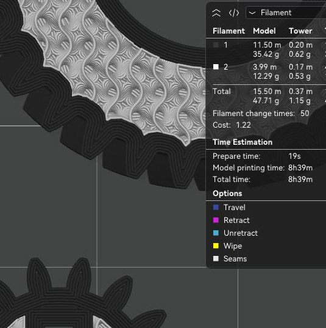 | 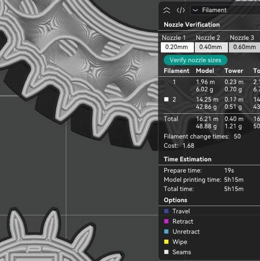 | 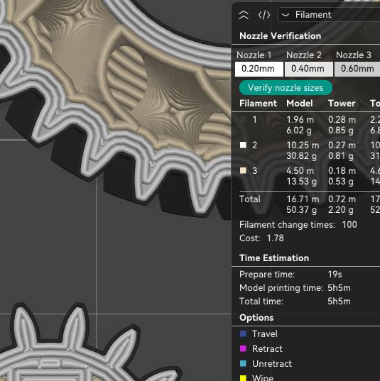 | 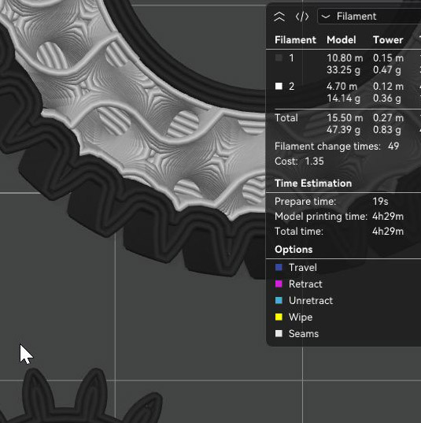 |
| Fine detail, slow print — **8h 39m** | Fine detail, faster print — **5h 15m** | Fine detail, faster print — **5h 5m** | Less detail, fastest print — **4h 29m** |

## Download

👉 **[Latest Release](https://github.com/jiyang1018/FOrcaSlicer/releases/latest)**

- `FOrcaSlicer_Windows_Installer_V*.exe` — Windows installer
- `FOrcaSlicer_Windows_Portable_V*.zip` — Windows portable (no install needed)

## Development Roadmap

Track progress, design decisions, and implementation details:
👉 **[View the interactive roadmap](https://jiyang1018.github.io/FOrcaSlicer-roadmap/)**

---

## What it adds

The Snapmaker U1 has 4 independent heads that can carry different nozzle diameters (e.g. 0.2 / 0.4 / 0.6 / 0.8 mm). Stock Snapmaker OrcaSlicer syncs every head to the same size. FOrcaSlicer unlocks them.

### Mixed nozzle sizes

- Independent nozzle diameter per head.
- **Outer wall (OW)** and **inner wall (IW)** are split out from "Walls" in the Multimaterial tab, so they can go to different heads. See the [OW / IW Split guide (wiki)](https://github.com/jiyang1018/FOrcaSlicer/wiki/OW-IW-Split).
- Outer wall, inner wall, infill, solid infill, support, and the prime tower can each be assigned to a different nozzle.
- **Per-nozzle line width and speed** — every feature is sized and sped from the process preset of the nozzle that actually prints it, instead of everything inheriting Nozzle 1.
- **Per-nozzle prime tower line width** — each tool wipes and rams at its own width.
- **One layer height, guarded by the smallest nozzle you use** — layer and first-layer height are a single global value, automatically limited to the range the smallest active nozzle can print, so you can't ask a 0.2 mm tip to lay a 0.6 mm layer.
- Nozzle verification dialog before printing.
- Preview line widths reflect each extruder's actual nozzle diameter.
- **On a single-nozzle-size machine, output is identical to stock** — every change is a no-op when all nozzles match.

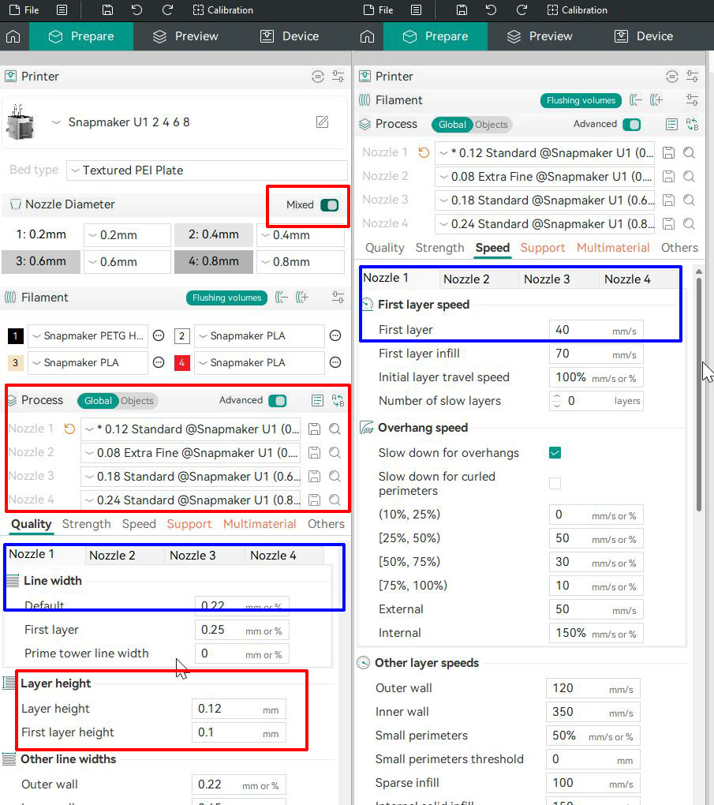

*Turn on **Mixed**, give each nozzle its own process preset, then set line width and speed per nozzle in the Quality and Speed tabs. Layer height stays global, below the nozzle tabs.*

### Color Patch pipeline

When you paint a surface, only its outer shell prints in the painted filament; the interior stays base material. The point isn't color — it's that **the shell and the core can be different materials**, held together by geometry. That unlocks two things stock's paint mode can't do.

**Mix materials and textures.** In stock (Original) mode, each painted material is a solid region sitting *beside* the next — so a soft TPU grip painted next to a rigid PETG body simply delaminates, because TPU won't bond to PETG. Color Patch makes the painted material **wrap** the core instead: a TPU grip becomes a soft skin held mechanically onto a PETG core, and a translucent edge glows over a metallic core. Regions you leave in Original mode stay solid volumes — so red accents read as inset gems rather than surface paint — and the infill pattern shows through the translucent regions as part of the design. None of this needs different nozzle sizes.

| Painted surface, Original mode | Painted surface, Color Patch mode |
|---|---|
| 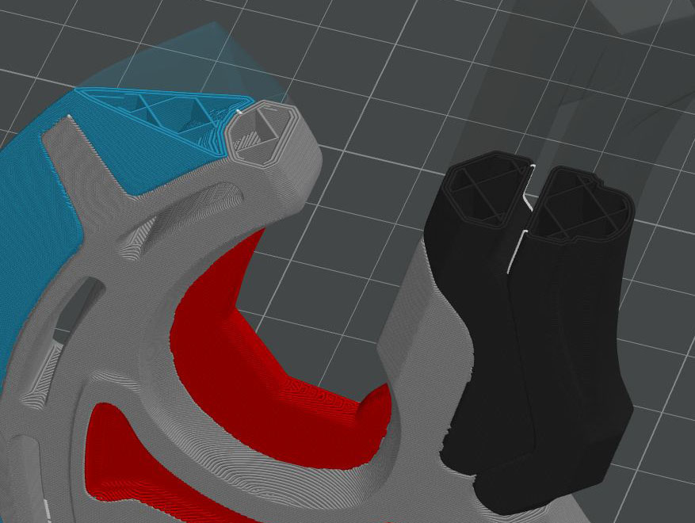 | 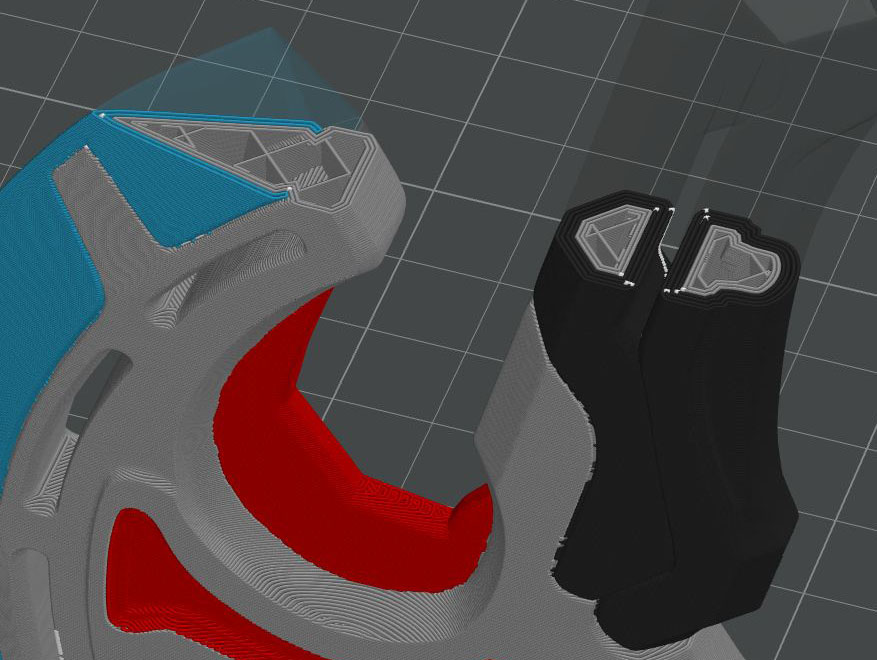 |

*Model: [Star Orbit Judgment Axe](https://makerworld.com/en/models/2332850-star-orbit-judgment-axe) by Ted_k on MakerWorld.*

**See through the shell.** Paint a legging black in Original mode and the leg prints solid black all the way through — a black leg, not clothing. Color Patch prints the painted region as a **translucent shell** (optionally on a 0.2 mm nozzle for a thinner one) over a skin-colored core, so the base reads through it the way fabric does. The effect depends on a **translucent filament** — the best look takes some experimentation with the filament's color and translucency.

| A painted model | Original: legs solid black throughout | Color Patch: translucent shell over skin-colored core |
|---|---|---|
| 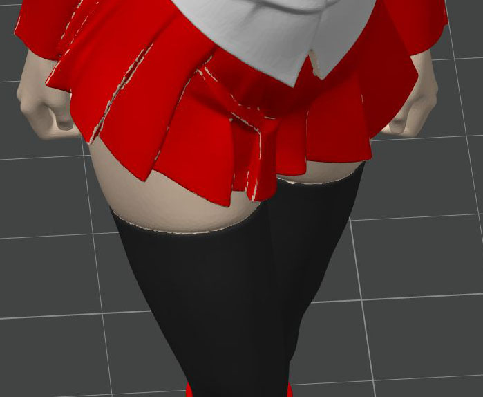 | 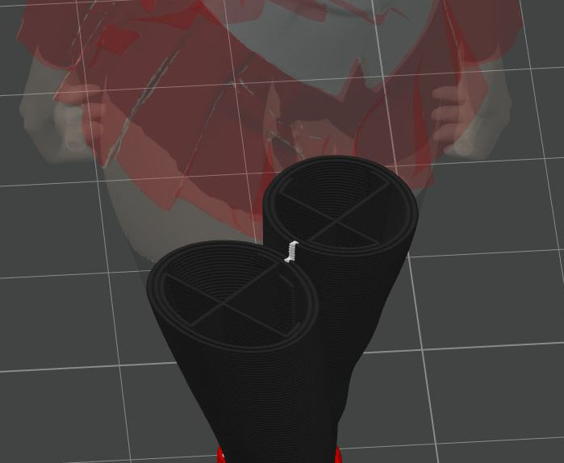 | 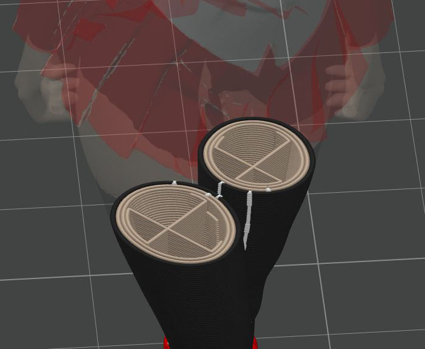 |

*Model: [Anime girl figure](https://makerworld.com/en/models/2598006-anime-girl-figure) by "I know U" on MakerWorld.*

**CL — Color Loops** is the one knob: how many perimeter loops the painted color occupies inward from the surface (CL = 1 is the thinnest skin; higher is thicker and more opaque). Set per object and per painted color. Because loop width follows the *painted nozzle's* own flow, CL is a count of loops, not a fixed thickness — CL = 1 on a 0.8 mm nozzle is four times thicker than CL = 1 on a 0.2 mm nozzle.

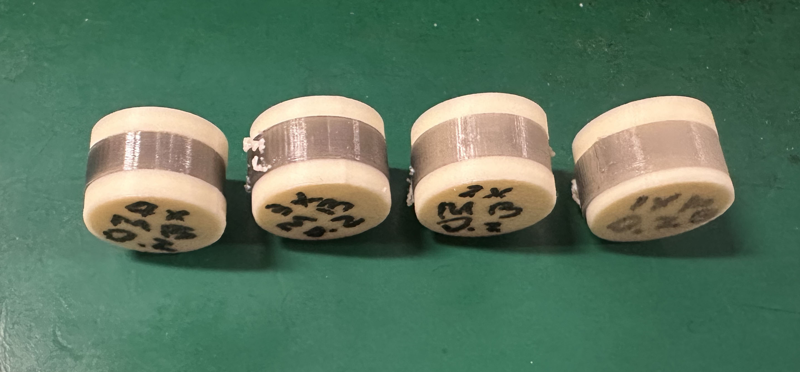

*CL 4 → 1 on a 15 mm cylinder: translucent gray PLA Color Patch (0.2 mm nozzle) over a skin-color PLA base (0.4 mm nozzle). Lower CL = thinner, more see-through.*

Original-mode geometry stays **byte-identical to stock OrcaSlicer** (verified by diff), and settings save/load with `.3mf`.

> Full walkthrough, material combinations, and CL tuning: **[Color Patch guide (wiki)](https://github.com/jiyang1018/FOrcaSlicer/wiki/Color-Patch)**

---

## Install (Windows)

1. Download the installer or portable zip from the [releases page](https://github.com/jiyang1018/FOrcaSlicer/releases).
2. If it won't start, install these runtimes:
   - [Microsoft Edge WebView2 Runtime](https://go.microsoft.com/fwlink/p/?LinkId=2124703)
   - [Visual C++ 2019 Redistributable (x64)](https://aka.ms/vs/17/release/vc_redist.x64.exe)
3. For step-by-step instructions, follow the [Download and Install guide (wiki)](https://github.com/jiyang1018/FOrcaSlicer/wiki/Download-and-Install).

**First run:** follow the [First Launch guide (wiki)](https://github.com/jiyang1018/FOrcaSlicer/wiki/First-Launch) to log in with your Snapmaker account and set up your printer.

**Before your first print:** read [Before You Print (wiki)](https://github.com/jiyang1018/FOrcaSlicer/wiki/Before-You-Print) — picking nozzle types and diameters, replacing hot ends, and why not to sync nozzle info. FOrcaSlicer behaves differently from stock in ways that matter here, so it's worth the few minutes.

**macOS / Linux:** not yet packaged — build from source (below).

---

## Build from source

### Windows (64-bit)

Requires: **Visual Studio 2022**, CMake 3.14+, Git, Git-LFS, Strawberry Perl.

```powershell
git clone https://github.com/jiyang1018/FOrcaSlicer
cd FOrcaSlicer
git lfs pull

# build dependencies once, then the slicer:
build_release_vs2022.bat deps
build_release_vs2022.bat slicer
# (or just `build_release_vs2022.bat` to do both)
```

Output: `build\src\Release\FOrcaSlicer.exe`

**Build the Windows installer** (requires [NSIS](https://nsis.sourceforge.io/Download)):

```powershell
.\build_installer.ps1 -Version 2.3.2-fos.8.5
```

### macOS (64-bit)

Requires: Xcode, CMake, Git, and: `brew install cmake gettext libtool automake autoconf texinfo`

```bash
./build_release_macos.sh
```

### Linux (Ubuntu)

```bash
./build_linux.sh -u      # first time: install system dependencies
./build_linux.sh -dsi    # build dependencies, slicer, and AppImage
```

---

## Klipper note

If you run Klipper, add this to your `printer.cfg`:

```
[exclude_object]
[gcode_arcs]
resolution: 0.1
```

---

## Contributing

Bug reports and feature requests are welcome at [GitHub Issues](https://github.com/jiyang1018/FOrcaSlicer/issues). This is a U1-focused fork — please include your nozzle setup, a `.3mf` if relevant, and the FOrcaSlicer version (Help → About) when reporting slicing issues.

---

## The name

**FOrcaSlicer** means two things:

1. **F**lexible **Orca**Slicer — extends OrcaSlicer with flexible per-head configuration.
2. **Fork**-a-Slicer — a fork of the original OrcaSlicer.

---

## Lineage

FOrcaSlicer is forked from Snapmaker OrcaSlicer, which is forked from [OrcaSlicer](https://github.com/SoftFever/OrcaSlicer) by SoftFever, which is forked from Bambu Studio by BambuLab, which is forked from [PrusaSlicer](https://github.com/prusa3d/PrusaSlicer) by Prusa Research, which is based on [Slic3r](https://github.com/Slic3r/Slic3r) by Alessandro Ranellucci and the RepRap community. FOrcaSlicer also incorporates features from SuperSlicer by @supermerill.

## License

FOrcaSlicer is licensed under the **GNU Affero General Public License, version 3** — the same license as OrcaSlicer, Bambu Studio, PrusaSlicer, and Slic3r before it. AGPL-3.0 requires that if you use any part of this software in any way (even behind a web server), your software must be released under the same license. See [LICENSE](LICENSE).
